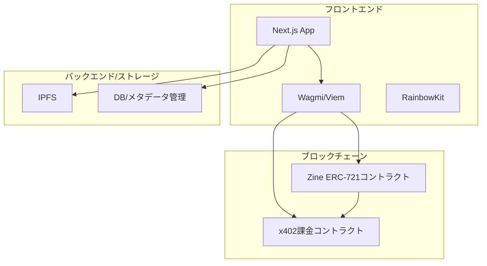

# zine dapp 設計書

## 概要

zine dappは、書籍・zine等のPDFコンテンツをIPFSにアップロードし、ERC-721トークン（本のレシート）で利用権を管理するWebアプリケーションです。MetaMask連携・Base Sepolia対応で、作者はコンテンツを公開・販売し、買い手はウォレットで決済・ダウンロードが可能です。

## システム全体構成



## レイヤー構成

1. **プレゼンテーション層**: Next.js + TailwindCSS
2. **Web3インタラクション層**: wagmi + viem + RainbowKit
3. **スマートコントラクト層**: Solidity (ERC-721, x402) + Hardhat（コントラクトのテスト・デプロイに使用）
4. **ストレージ層**: IPFS, DB (メタデータ)
5. **ブロックチェーン層**: Base Sepolia

## 画面構成

1. **コンテンツアップロード画面**
    - コンテンツ名入力欄
    - 金額入力欄
    - ファイルアップロード部品
    - submitボタン
2. **決済要求画面**
    - 金額表示
    - コンテンツ名表示
    - 購入ボタン（x402課金）
3. **決済完了画面**
    - 決済完了メッセージ
    - ダウンロードリンク（IPFS）

## コンポーネント構成

```
frontend/
├── components/
│   ├── ContentUploadForm.tsx   # アップロード画面
│   ├── PaymentRequest.tsx      # 決済要求画面
│   ├── PaymentSuccess.tsx      # 決済完了画面
│   ├── WalletConnect.tsx       # ウォレット接続
│   └── UI/                    # Button, Input, Modal等
├── hooks/
│   ├── useIPFS.ts              # IPFSアップロード
│   ├── useZineNFT.ts           # ERC-721連携
│   ├── useX402.ts              # x402課金連携
│   └── useWallet.ts            # ウォレット状態
├── lib/
│   ├── constants.ts            # 定数
│   ├── contracts.ts            # コントラクト設定
│   └── utils.ts                # ユーティリティ
└── types/
    ├── content.ts              # コンテンツ型
    └── user.ts                 # ユーザー型
```

## スマートコントラクト構成

```
contract/
├── ZineNFT.sol      # ERC-721 本のレシート
├── x402Pay.sol      # x402課金
└── interfaces/
    └── IZineNFT.sol
```

### ZineNFT.sol（ERC-721）
- コンテンツごとにデプロイ
- メタデータURI（IPFS）
- 購入時にNFT発行

### x402Pay.sol
- 金額・受取人・NFTコントラクトアドレス指定で決済
- 決済完了時にNFT発行

## データモデル

### Content（コンテンツ）
- id: string
- name: string
- price: number
- ipfsHash: string
- author: address
- nftContract: address

### User
- address: string
- purchasedContents: Content[]

## 主要インターフェース

### useIPFS.ts
- uploadFile(file: File): Promise<string> // IPFSハッシュ返却

### useZineNFT.ts
- mintNFT(to: address, contentId: string): Promise<void>
- getOwnedNFTs(address): Promise<NFT[]>

### useX402.ts
- requestPayment(amount: number, to: address, nftContract: address): Promise<void>

## エラーハンドリング
- ファイルアップロード失敗時: "アップロードに失敗しました"
- 決済失敗時: "決済に失敗しました"
- NFT発行失敗時: "NFTの発行に失敗しました"

## テスト戦略
- スマートコントラクト: Hardhat + Chai
- フロントエンド: React Testing Library
- E2E: Playwright

## セキュリティ
- 入力値検証
- コントラクトのreentrancy対策
- IPFSリンクの検証

## 対応ネットワーク
- Base Sepolia（ChainID: 84532, RPC: https://sepolia.base.org）

## 備考
- デザインはシンプル・直感的に
- 画面遷移は明快に
- 主要な処理はカスタムフックで分離
