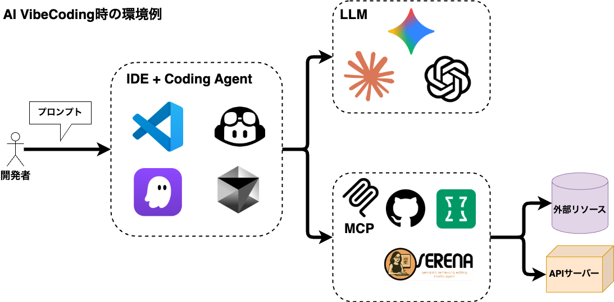

<!-- _class: lead -->
<!-- _backgroundColor: #000 -->

## A Hands-on Web3 AI Vibe Coding Workshop

---

## **本日のアジェンダ**

1.  **オープニング、自己紹介 (5分)**
2.  **本日のゴールと流れ (5分)**
3.  **AI Vibe Coding ライブデモ (10分)**
4.  **AI Vibe Coding のコツ (10分)**
5.  **ハンズオン (90〜125分)**
6.  **まとめ、振り返り (5分)**
7.  **成果発表 & 交流会 (20〜55分)**

---

## **はじめに：講師紹介**

  
  

    <h3>Haruki</h3>
    

      <strong>UNCHAIN Admin</strong>
    

    <ul>
      <li>Web3エンジニア</li>
      <li>ETH Tokyo'24 finalist</li>
    </ul>
    <ul class="social-list">
      <li>X: @haruki_web3</li>
      <li>GitHub: mashharuki</li>
    </ul>
  

---

## **本ワークショップのゴール**

このワークショップが終わる頃、あなたは…

<ul>
  <li><strong>Web3アプリのプロトタイプを開発する</strong>方法をゲット</li>
   
  <li>AIの力を最大限に引き出す<strong>
  「コツ」</strong>が手に入ります</li>
</ul>

---

## **AI Vibe Coding ライブデモ**

### **「AIと一緒にdAppが生まれる瞬間」**

 

これから、**AIとの対話**を中心にDEXのプロトタイプを**ゼロから構築**する様子をお見せします。

---

**お題： AMM DEXを作ろう！**

 

1. 要件定義書と設計書の作成
2. タスクリストの作成
3. 実装開始

---

## **AI Vibe Coding のコツ**

これを知っているだけで、
AI駆動開発体験は劇的に向上します！

**特に重要な4つのポイント**をご紹介します。

---

### **コツ①：複数のモデルを使い分ける**

<strong>「できること・得意なこと」はモデルで異なります</strong>

<ul>
  <li><strong>コーディングが得意なモデル</strong> （例: Claude）</li>
   
  <li><strong>マルチモーダル処理ができるモデル</strong> （例: Gemini）</li>
</ul>

---

### **コツ②：MCPでAIの機能を強化する**

<strong>MCP</strong>を使うとAIはあなたのプロジェクトの

<strong>強力な「専属アシスタント」</strong>になります！

---

### **コツ②：MCPでAIの機能を強化する**

<ul>
  <li>ファイル構造やコーディング規約をAIに直接教え込むことができます。</li>
   
  <li>これによりAIはプロジェクトの文脈を深く理解し、より的確なコードを生成してくれるようになります。</li>
</ul>

---

### **コツ③：段階的に進める**

一度に完璧を目指す必要はありません。 <strong>「小さく作って、次に進める」</strong>が成功への近道です。

---

### **コツ③：段階的に進める**

<ul>
  <li>要件定義書と設計書とタスクリストを作成する</li>
  <li>プロジェクトの全体をセットアップする</li>
  <li>スマートコントラクトを実装する</li>
  <li>フロントエンドを実装する</li>
</ul>

---

### **コツ④：カスタムインストラクション**

AIへの<strong>「指示の出し方」</strong>も重要です。

 カスタムインストラクションファイルを

事前に準備しましょう。

 

明確な指示が、AIの力を最大化します！

---

<!-- _backgroundColor: var(--color-primary) -->
<!-- _color: #fff -->

# **Hands-on Time!**
## **(90〜125分)**

---

 

1.  **基本編：DEX（分散型取引所）開発**
    - まずは用意されたお題で、AI Vibe Codingの基本フローを体験！

---

2.  **応用編：オリジナルdApp開発** (時間があれば)
    - あなたの自由なアイデアで、世界に一つだけのdAppを創造しよう！

---

## **ハンズオンの手順**

<ul>
  <li><strong>要件定義書と設計書とタスクリストを作成する</strong></li>
  <li><strong>プロジェクトのセットアップ</strong></li>
  <li><strong>スマートコントラクトの開発</strong></li>
  <li><strong>フロントエンドの開発</strong></li>
</ul>

---

## **見本のGitHub**

[GitHub -Web3AIVibeCodingStarterKit](https://github.com/mashharuki/Web3AIVibeCodingStarterKit/tree/amm_dex)

---

## **見本のドキュメント**

以下のドキュメントを参考にしてください！

[プロンプト](https://github.com/mashharuki/Web3AIVibeCodingStarterKit/blob/amm_dex/docs/prompt/amm_dex.md)

[要件定義書](https://github.com/mashharuki/Web3AIVibeCodingStarterKit/blob/amm_dex/docs/design/amm_dex/amm_dex_requirements.md)

[タスクリスト](https://github.com/mashharuki/Web3AIVibeCodingStarterKit/blob/amm_dex/docs/design/amm_dex/task.md)

---

## **見本の設定ファイル**

[Claude Codeの設定ファイル](https://github.com/mashharuki/Web3AIVibeCodingStarterKit/tree/main/.claude)

[Gemini CLIの設定ファイル](https://github.com/mashharuki/Web3AIVibeCodingStarterKit/tree/main/.gemini)

[GitHub Copilotの設定ファイル](https://github.com/mashharuki/Web3AIVibeCodingStarterKit/tree/main/.github)

[Kiroの設定ファイル](https://github.com/mashharuki/Web3AIVibeCodingStarterKit/tree/main/.kiro)

---

<!-- _backgroundColor: var(--color-secondary) -->
<!-- _color: #fff -->

# **Q&A / 成果発表会**
---

## **本日のまとめ**

今日、私たちはAI Vibe Codingの世界を探求し、

その驚くべき可能性を体験しました。

---

## **本日のまとめ**

成功の鍵となる<strong>4つのポイント</strong>

<ul>
  <li>✅ <strong>複数のモデルを使い分ける</strong></li>
  <li>✅ <strong>MCPを使ってAIの機能を強化する</strong></li>
  <li>✅ <strong>段階的に進める</strong></li>
  <li>✅ <strong>カスタムインストラクションのセットアップ</strong></li>
</ul>

---

<!-- _class: lead -->
<!-- _backgroundColor: #000 -->

# **Thank You!**

---

## 補足資料

---

## **AI VibeCodingの環境全体像**

---

---

## **おすすめツール等の紹介**

---

### IDE

---

- **VS Code(GitHub Copilotとの併用前提)**

- **Kiro**

---

### Coding Agent

---

- **GitHub Copilot Agent Mode**

- **Gemini CLI**

- **Kiroに内蔵されたCoding Agent**

- **Claude Code**

---

### MCP

---

- **context7**

- **serena MCP**

- **GitHub MCP**

- **sequential-thinking**